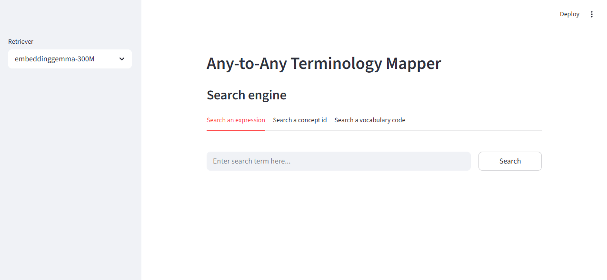

# CLI Quick Start

This page shows how to use **AATM entirely from the command line**.

It is focused on the actual CLI workflow exposed by the commads: `init`, `map`, and `search-ui`.

---

## What you can do from the CLI

With the CLI, you can:

- initialize the local environment
- build the local SQLite vocabulary database
- build the mapping datasets
- build the local vector database
- run terminology mapping jobs
- launch the interactive search UI

The main commands are:

- `aatm init`
- `aatm map`
- `aatm search-ui`

---

## 1. Prepare your OMOP vocabularies directory

Before running `aatm init`, download the OMOP vocabularies you want to use and place them in a directory. You can find them at https://athena.ohdsi.org/vocabulary/list

By default, the CLI expects it at the root directory:

```text
./vocabularies
```

If you do not use that location, you can point the CLI to a different directory with the option `--vocab-dir` or `-vd`. The CLI validates this path during initialization.

---

## 2. Run the initialization command

The `init` command is the main CLI setup workflow.

It does all of the following for you:

- creates the local `.aatm` helper directory where the local databases and aatm config files will be stored
- ensures `.aatm` is added to `.gitignore`
- builds the local OMOP SQLite database
- lets you choose an embedding model
- lets you choose the standard vocabularies
- builds the mapping datasets
- builds the local vector database

That means you do **not** need to call Python setup functions manually for the normal setup flow. At the end, you will be ready to run terminology mapping tasks.

### Simplest setup

```bash
aatm init
```

This uses the default vocab directory and interactively asks you to choose the embedding model, standard vocabularies and other options.

### Setup with a custom vocab directory

```bash
aatm init --vocab-dir ./my_vocabularies
```

### Setup with an explicit embedding model

```bash
aatm init --embedding-model embeddinggemma-300M
```

### Setup with explicit standard vocabularies

```bash
aatm init --standard-vocabs LOINC --standard-vocabs SNOMED --standard-vocabs RxNorm
```

### Fully explicit setup

```bash
aatm init \
  --vocab-dir ./vocabularies \
  --embedding-model embeddinggemma-300M \
  --standard-vocabs LOINC \
  --standard-vocabs SNOMED \
  --standard-vocabs RxNorm
```

## 3. Prepare your input CSV

After initialization, prepare the CSV you want to map.

The mapper expects an OMOP-style `SOURCE_TO_CONCEPT_MAP` input structure, including these columns:

- `source_code`
- `source_concept_id`
- `source_vocabulary_id`
- `source_code_description`
- `valid_start_date`
- `valid_end_date`
- `invalid_reason`

Example:

```csv
source_code,source_concept_id,source_vocabulary_id,source_code_description,valid_start_date,valid_end_date,invalid_reason
A01,,LOCAL,"Dor no peito",2020-01-01,2099-12-31,
B02,,LOCAL,"Diabetes mellitus tipo 2",2020-01-01,2099-12-31,
```

---

## 4. Run mapping directly from the CLI

The `map` command runs a terminology mapping task. You can use it in two ways:

- with a task config file
- with explicit CLI options

Both paths are supported directly by the CLI implementation.

### Option A: run from explicit CLI arguments

This is the most direct fully-CLI workflow.

```bash
aatm map \
  --input-file data/source_to_concept_map.csv \
  --output-dir output \
  --translator-id empty-translator \
  --retriever-id embeddinggemma-300M \
  --reranker-id bm25-reranker \
  --selector-id first-result-selector \
  --batch-size 100
```

#### Run a small test job

Use `--limit-to` when you want to test with only a few rows.

```bash
aatm map \
  --input-file data/source_to_concept_map.csv \
  --output-dir output \
  --translator-id empty-translator \
  --retriever-id embeddinggemma-300M \
  --reranker-id bm25-reranker \
  --selector-id first-result-selector \
  --limit-to 20
```

#### Apply rate limiting

If needed, you can also pass a rate limit:

```bash
aatm map \
  --input-file data/source_to_concept_map.csv \
  --output-dir output \
  --translator-id gemini-2.5-flash \
  --retriever-id embeddinggemma-300M \
  --reranker-id bm25-reranker \
  --selector-id first-result-selector \
  --batch-size 50 \
  --rate-limit 100
```

The CLI accepts all of these options directly.

---

### Option B. Run mapping from a config file

The other CLI workflow is to store the mapping task in a config file and pass it with `--task-config-path` or `-t`.

#### Example command

```bash
aatm map --task-config-path task.yaml
```

When you do this, the CLI loads the task config file and runs the mapping task from it. 

#### Example task config

Task config files are supported as `.yaml` or `.json` files.

=== "YAML"

    ```yaml
    input_file: data/source_to_concept_map.csv
    output_dir: output
    translator_id: empty-translator
    retriever_id: embeddinggemma-300M
    reranker_id: bm25-reranker
    selector_id: first-result-selector
    batch_size: 100
    rate_limit: null
    limit_to: null
    ```

=== "JSON"

    ```json
    {
      "input_file": "data/source_to_concept_map.csv",
      "output_dir": "output",
      "translator_id": "empty-translator",
      "retriever_id": "embeddinggemma-300M",
      "reranker_id": "bm25-reranker",
      "selector_id": "first-result-selector",
      "batch_size": 100,
      "rate_limit": null,
      "limit_to": null
    }
    ```

This is useful when you want reproducible runs or reusable task definitions.

---

## 5. Launch the search UI from the CLI

You can also launch the Streamlit-based search interface directly from the CLI:

```bash
aatm search-ui
```

The CLI resolves the packaged `search_ui.py` file and launches it through Streamlit using the current Python interpreter. 


/// caption
Streamlit search UI screenshot.
///

---

## 6. What gets created locally

After a normal CLI setup and mapping workflow, you will typically have local artifacts such as:

```text
.aatm/
├── omop.db
├── datasets/
└── chroma_vector_dbs/
```

And your mapped output will typically be written to:

```text
output/mapped_source_concepts.csv
```

The CLI `init` command is responsible for creating the local helper resources, and the `map` command runs the terminology mapping workflow. 

---

## 7. End-to-end CLI example

Here is a full CLI-only path.

### Step 1: initialize

```bash
aatm init \
  --vocab-dir ./vocabularies \
  --embedding-model embeddinggemma-300M \
  --standard-vocabs LOINC \
  --standard-vocabs SNOMED \
  --standard-vocabs RxNorm
```

### Step 2: run mapping

```bash
aatm map \
  --input-file data/source_to_concept_map.csv \
  --output-dir output \
  --translator-id empty-translator \
  --retriever-id embeddinggemma-300M \
  --reranker-id bm25-reranker \
  --selector-id first-result-selector \
  --batch-size 100
```

### Step 3: inspect output

```bash
ls output
```

You should see the mapped CSV file there.

### Step 4: optionally launch the search UI

```bash
aatm search-ui
```

---

## 8. Troubleshooting

### `aatm init` says the vocabulary directory does not exist

Make sure your OMOP vocabulary files are present in `./vocabularies`, or pass the correct path with:

```bash
aatm init --vocab-dir /path/to/vocabularies
```

The CLI explicitly checks whether the provided directory exists. 

### `aatm init` says the embedding model is unsupported

Use one of the supported model names listed in this page. The CLI validates the model name before continuing. 

### `aatm map` says the task config file does not exist

Check the path you passed to:

```bash
aatm map --task-config-path task.yaml
```

The CLI verifies that the config file exists before loading it. 

### Retrieval fails at mapping time

Make sure you ran `aatm init` first and successfully built the local vector database for the retriever you want to use.

### API-backed components fail

Check that your `.env` file contains the required API keys.
