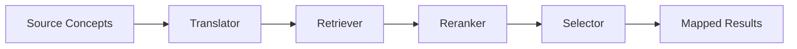

# Python API Quick Start

This page shows how to use **AATM from the Python API**.

---

## What you can do from the Python API

With the Python API, you can:

- initialize and configure a terminology mapping pipeline in code
- load translators, retrievers, rerankers, and selectors from registries
- instantiate `TerminologyMapper` directly
- build a mapper from a structured task configuration
- run mapping jobs from Python
- work with pipeline components individually
- compose stages with the `|` operator

The package exposes dedicated base classes and concrete implementations for translators, retrievers, rerankers, selectors, and the main `TerminologyMapper` orchestration class. 

---


## 1. Understand the main Python entry point

The main class is `TerminologyMapper`.

It orchestrates the full mapping workflow by combining:

- a translator
- a retriever
- an optional reranker
- a selector

Its constructor accepts these components directly, along with settings such as `input_file`, `output_dir`, `batch_size`, `rate_limit`, `column_mapping`, and `limit_to`. It also provides defaults when some components are omitted. 

Conceptually, the pipeline looks like this:



The mapping flow inside `TerminologyMapper.map()` processes source concepts in batches, translates them, retrieves candidates, optionally reranks them, selects final matches, and writes the output DataFrame to disk.

---

## 2. Example

A good first setup is:

- `empty-translator`
- `embeddinggemma-300M`
- `bm25-reranker`
- `first-result-selector`

These can be loaded from the package registries and passed into `TerminologyMapper`. 

```python
from aatm.terminology_mapper import TerminologyMapper
from aatm.registries.translators import load_translator
from aatm.registries.retrievers import load_retriever
from aatm.registries.rerankers import load_reranker
from aatm.registries.selectors import load_selector

mapper = TerminologyMapper(
    translator=load_translator("empty-translator"),
    retriever=load_retriever("embeddinggemma-300M"),
    reranker=load_reranker("bm25-reranker"),
    selector=load_selector("first-result-selector"),
    batch_size=100,
)

results_df = mapper.map("data/source_to_concept_map.csv")
print(results_df.head())
```

---

## 3. Prepare your input CSV

The mapper expects an OMOP-style `SOURCE_TO_CONCEPT_MAP` input structure.

The required columns checked by `map_csv_to_source_concepts()` are:

- `source_code`
- `source_concept_id`
- `source_vocabulary_id`
- `source_code_description`
- `valid_start_date`
- `valid_end_date`
- `invalid_reason`

These required columns are hardcoded in `TerminologyMapper.expected_columns`, and the CSV loader validates them before continuing.

Example:

```csv
source_code,source_concept_id,source_vocabulary_id,source_code_description,valid_start_date,valid_end_date,invalid_reason
A01,,LOCAL,"Dor no peito",2020-01-01,2099-12-31,
B02,,LOCAL,"Diabetes mellitus tipo 2",2020-01-01,2099-12-31,
```

---

## 4. Run mapping from Python

Once your mapper is configured, run mapping like this:

```python
results_df = mapper.map("data/source_to_concept_map.csv")
```

You can also limit the number of rows processed during testing:

```python
results_df = mapper.map("data/source_to_concept_map.csv", limit_to=20)
```

You can control whether confidence scores are included:

```python
results_df = mapper.map(
    "data/source_to_concept_map.csv",
    return_confidence_scores=True,
)
```

Although `source_code_description` values are translated as defined by the translator, the original values are stored in the column `source_code_description_original`.

The `map()` method writes the mapped results to `mapped_source_concepts.csv` inside the configured output directory and returns the resulting DataFrame.

---

## 5. Use custom column names

If your CSV uses different column names, pass `column_mapping` when constructing the mapper.

`map_csv_to_source_concepts()` renames columns using this mapping before validating the expected schema. 

Note that the `TerminologyMapper` class won't create the required columns for you. You need to prepare the table beforehand.

```python
from aatm.terminology_mapper import TerminologyMapper
from aatm.registries.translators import load_translator
from aatm.registries.retrievers import load_retriever
from aatm.registries.rerankers import load_reranker
from aatm.registries.selectors import load_selector

mapper = TerminologyMapper(
    translator=load_translator("empty-translator"),
    retriever=load_retriever("embeddinggemma-300M"),
    reranker=load_reranker("bm25-reranker"),
    selector=load_selector("first-result-selector"),
    column_mapping={
        "code": "source_code",
        "description": "source_code_description",
        "vocabulary": "source_vocabulary_id",
        "start_date": "valid_start_date",
        "end_date": "valid_end_date",
        "reason": "invalid_reason",
        "concept_id": "source_concept_id",
    },
)

results_df = mapper.map("data/my_input.csv")
```

---

## 6. Build a mapper from a task configuration object

You can also create the mapper from a structured `TerminologyMappingTask` object by calling `TerminologyMapper.from_task_config()`.

That classmethod resolves the configured translator, retriever, selector, and reranker from their registries and returns a ready-to-use mapper.

```python
from pathlib import Path

from aatm.data_models import TerminologyMappingTask
from aatm.terminology_mapper import TerminologyMapper

task = TerminologyMappingTask(
    input_file=Path("data/source_to_concept_map.csv"),
    output_dir=Path("output"),
    translator_id="empty-translator",
    retriever_id="embeddinggemma-300M",
    reranker_id="bm25-reranker",
    selector_id="first-result-selector",
    batch_size=100,
    rate_limit=None,
    limit_to=None,
)

mapper = TerminologyMapper.from_task_config(task)
results_df = mapper.map()
```

---

## 7. Load components directly from registries

The package provides registry loaders for translators, retrievers, rerankers, and selectors.

### Translators

The translator registry exposes at least:

- `empty-translator`
- `gemini-2.5-flash`

through `load_translator(name, **kwargs)`. 

```python
from aatm.registries.translators import load_translator

translator = load_translator("empty-translator")
```

### Retrievers

Retriever models are loaded with `load_retriever(model_name)`, which constructs a `ChromaDBRetriever` backed by the configured embedding function and ChromaDB path. 

Common registered retriever IDs include:

- `qwen3-06B`
- `qwen3-4B`
- `gemini-embedding-001`
- `embeddinggemma-300M`
- `text-embedding-3-small`
- `text-embedding-3-large` 

```python
from aatm.registries.retrievers import load_retriever

retriever = load_retriever("embeddinggemma-300M")
```

### Rerankers

The reranker registry exposes:

- `bm25-reranker`
- `qwen3-reranker-0.6b`
- `qwen3-reranker-4b`
- `qwen3-reranker-8b` 

```python
from aatm.registries.rerankers import load_reranker

reranker = load_reranker("bm25-reranker")
```

### Selectors

The selector registry exposes:

- `first-result-selector`
- `gpt-5.2`
- `gpt-5`
- `gpt-5-mini`
- `gpt-5-nano`
- `gemini-3-pro-preview`
- `gemini-3-flash-preview`
- `gemini-2.5-flash`
- `gemini-2.5-flash-lite`
- `gemini-2.5-pro` 

```python
from aatm.registries.selectors import load_selector

selector = load_selector("first-result-selector")
```

---

## 8. Work with components directly in Python

You do not need to go through `TerminologyMapper` for every workflow. The components are callable and can be used independently.

### Translator example

`BaseTranslator.__call__()` accepts a string, a list of strings, or a list of `SourceConcept` objects and returns a list of `Translation` objects. 

```python
from aatm.registries.translators import load_translator

translator = load_translator("empty-translator")
translations = translator(["Dor no peito", "Tosse"])
print(translations)
```

### Retriever example

`BaseRetriever.__call__()` accepts a string, a `Translation`, a list of strings, or a list of `Translation` objects and returns `RetrieverResults`. 

```python
from aatm.registries.retrievers import load_retriever

retriever = load_retriever("embeddinggemma-300M")
results = retriever(["chest pain", "cough"])
print(results)
```

### Reranker example

Rerankers consume `RetrieverResults` and return reordered `RetrieverResults`. 

```python
from aatm.registries.rerankers import load_reranker

reranker = load_reranker("bm25-reranker")
reranked = reranker(results)
print(reranked)
```

### Selector example

Selectors consume `RetrieverResults` and return `SelectorResults`. 

```python
from aatm.registries.selectors import load_selector

selector = load_selector("first-result-selector")
selected = selector(reranked)
print(selected)
```

---

## 9. Compose the pipeline with `|`

AATM components inherit pipeline behavior from `PipelineBaseClass`, which overloads the `|` operator. 

That means you can compose stages directly in Python:

```python
from aatm.registries.translators import load_translator
from aatm.registries.retrievers import load_retriever
from aatm.registries.rerankers import load_reranker
from aatm.registries.selectors import load_selector

translator = load_translator("empty-translator")
retriever = load_retriever("embeddinggemma-300M")
reranker = load_reranker("bm25-reranker")
selector = load_selector("first-result-selector")

selected = (
    ["Dor no peito", "Tosse"]
    | translator
    | retriever
    | reranker
    | selector
)

print(selected)
```

Inside `TerminologyMapper.map()`, the same style is used for the core pipeline flow. 

---

## 10. Understand the default behaviors

If you instantiate `TerminologyMapper()` without passing components:

- translator defaults to `EmptyTranslator()`
- retriever defaults to a `ChromaDBRetriever` backed by `GoogleEmbeddingFunction(model="gemini-embedding-001")`
- selector defaults to `FirstResultSelector()`
- reranker defaults to `PipelineBaseClass()` as an identity-like empty reranker stage 

That can be convenient, but for reproducible setups it is usually better to pass your components explicitly.

---

## 11. Asynchronous mapping

`TerminologyMapper` also defines an `amap()` method for asynchronous mapping. It follows the same high-level idea as `map()`, processing source concepts in batches and returning a DataFrame. 

A minimal pattern looks like this:

```python
import asyncio

from aatm.terminology_mapper import TerminologyMapper

mapper = TerminologyMapper()

async def main():
    df = await mapper.amap("data/source_to_concept_map.csv", limit_to=20)
    print(df.head())

asyncio.run(main())
```

Use this only if your configured components support the async flow you want.

---

## 12. What gets created locally

A normal Python workflow may create or use local artifacts such as:

```text
.aatm/
├── omop.db
├── datasets/
└── chroma_vector_dbs/
```

Mapped outputs are typically written to:

```text
output/mapped_source_concepts.csv
```

The retriever registry also derives ChromaDB paths from `.aatm/chroma_vector_dbs/<model_name>`. 

---

## End-to-end Python example

Here is a full Python-only path.

```python
from aatm.terminology_mapper import TerminologyMapper
from aatm.registries.translators import load_translator
from aatm.registries.retrievers import load_retriever
from aatm.registries.rerankers import load_reranker
from aatm.registries.selectors import load_selector

mapper = TerminologyMapper(
    translator=load_translator("empty-translator"),
    retriever=load_retriever("embeddinggemma-300M"),
    reranker=load_reranker("bm25-reranker"),
    selector=load_selector("first-result-selector"),
    batch_size=100,
    output_dir="output",
)

results_df = mapper.map(
    file_path="data/source_to_concept_map.csv",
    limit_to=50,
    return_confidence_scores=True,
)

print(results_df.head())
```

---

## Troubleshooting

### The retriever fails because the local vector database is missing

Make sure you already created the local ChromaDB resources for the retriever model you want to use.

### Your CSV fails validation

Make sure your input file contains the expected OMOP columns, or pass `column_mapping`.

### API-backed components fail

Check your `.env` file and confirm the required API keys are present.

### A selector or reranker name is rejected

Use one of the registered names shown in this page. The registry loaders raise `ValueError` when a name is unknown. 