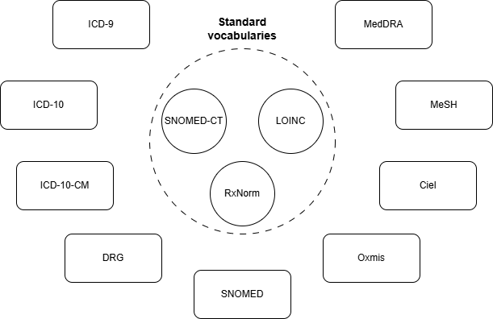

# Welcome

**Any-to-Any Terminology Mapping** is an open-source Python framework designed to facilitate terminology mapping tasks. The library organizes this process in a modular and extensible way to support multiple use cases and incorporate new techniques as they emerge.

In simple terms, mapping a new expression to a specific terminology involves considering many possible expressions, retrieving the best candidate target terms, and selecting them manually, which can be effortful and time-consuming.

AATM leverages the [OMOP vocabularies](https://athena.ohdsi.org/search-terms/start) to facilitate this task. These vocabularies reflect large, community-driven mapping efforts that connect many different health-related terminologies and classifications worldwide and organize them around standard terminologies, which serve as the central connecting nodes in the system. As these mapping efforts continue, healthcare-related concepts become increasingly well represented in these vocabularies, creating a virtuous cycle and increasing the chances of finding a strong correspondence for a new unmapped expression.

/// caption
Standard vocabularies
///

To accomplish this, AATM organizes the mapping process into very simple steps: 

- **translation**, which can be optional; 
- **retrieval**, which explores what is available from prior mapping efforts; and
- **selection**, which connects a standard concept to the new expression being mapped. 

Once this connection is made, every link associated with that standard concept becomes immediately available, enabling mapping to many different terminologies and classifications that are already connected to that concept, effectively breaking down barriers to interoperability in healthcare.

/// caption
Terminology mapping pipeline
///

## Design principles

**Modularity**

AATM is designed as a pipeline of clearly separated components, each responsible for a specific part of the terminology mapping process. Translation, retrieval, reranking, and selection are treated as independent steps with well-defined interfaces. This separation makes the library easier to understand, test, maintain, and adapt. It also allows users to inspect and improve one part of the workflow without having to redesign the entire system.

This modular structure is especially important because terminology mapping is not a single uniform problem. Different use cases may require different translation strategies, retrieval methods, or selection criteria depending on the source language, target terminology, domain, or level of ambiguity in the input expressions. By isolating responsibilities, AATM allows each part of the pipeline to evolve independently while remaining compatible with the broader framework.

**Extensibility**

AATM was built with the expectation that terminology mapping methods will continue to evolve. New embedding models, retrieval systems, rerankers, large language model–based selectors, rule-based selectors, and domain-specific heuristics can be incorporated into the framework without requiring major changes to its core design. Users can replace existing components or add new ones while preserving the overall pipeline structure.

This extensibility is important both for research and for production settings. In research, it enables rapid experimentation with new methods and easier comparison between approaches. In applied settings, it allows users to adapt the system to new terminologies, new languages, and new operational requirements. In this sense, AATM is intended not only as a tool for performing terminology mapping, but also as a flexible foundation for building and evaluating new mapping workflows.

**Simplicity**

Although terminology mapping can involve complex methods, AATM is designed to keep the overall process conceptually simple. The framework reduces the task to a small number of intuitive steps that reflect how a person might approach the problem: optionally translate the input, retrieve possible matches, rerank or organize the candidates, and select the best concept. This organization helps make the library more accessible to users who are not specialists in information retrieval or machine learning.

Simplicity also guides the user experience. The library aims to provide clear abstractions, predictable behavior, and straightforward ways to configure and run mapping pipelines. This makes it easier to get started with basic workflows while still leaving room for more advanced customization when needed. By prioritizing simplicity, AATM seeks to lower the barrier to terminology mapping and make interoperable healthcare data workflows more approachable.